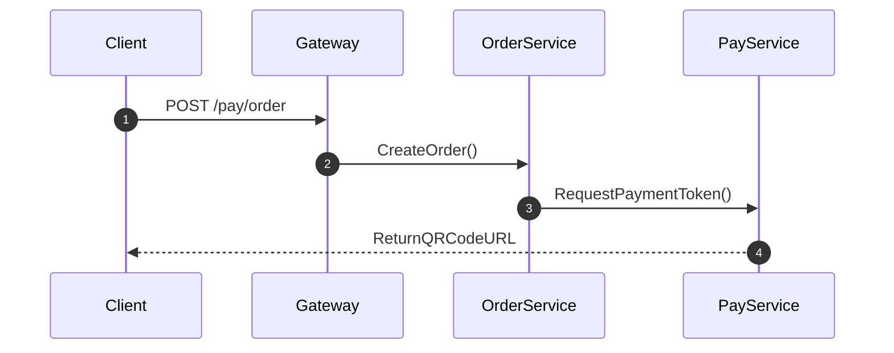

# 支付时序调用

微服务间的通信时序关系如下：

```mermaid
sequenceDiagram
  autonumber
  Client->>Gateway: POST /pay/order
  Gateway->>OrderService: CreateOrder()
  OrderService->>PayService: RequestPaymentToken()
  PayService-->>Client: ReturnQRCodeURL
```

订单处理完毕。
